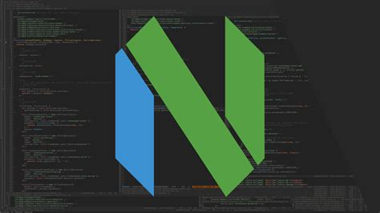

I've been dailying neovim for a while now and I decided to use the nightly build because why not, and it was okay for most things, I mean it is neovim after all.

But it kept crashing for reasons I wasn't really ready to figure out, so I did the sane thing - moved back to the stable version.
It was great and all but I missed the default theme that came with the nightly builds, it was really clean, and also I liked TJ's theme([gruvbuddy](https://github.com/tjdevries/gruvbuddy.nvim)) -very few colors on the screen.

I embarked on a journey to try and replicate the default theme from the nightly neovim builds. Luckily for me, I found [colorbuddy](https://github.com/tjdevries/colorbuddy.nvim) which made creating the colorscheme a breeze.
I didn't know exactly where to begin so I got some *inspiration* from [cactus buddy](https://github.com/redbug312/cactusbuddy)
I was quite pleased with the results actually, a colorscheme that got out of my way and didn't distract me with all the unicorn bullshit.

Is it perfect? - NO. It doesn't really cover every highlight group, just most of those that I interact with most of the time.

Will I update it? - Probably not, I feel like its satisfactory for me in its current state

Check it out [**jade.nvim**](https://github.com/musaubrian/jade.nvim) or give creating your own colorscheme a shot.

